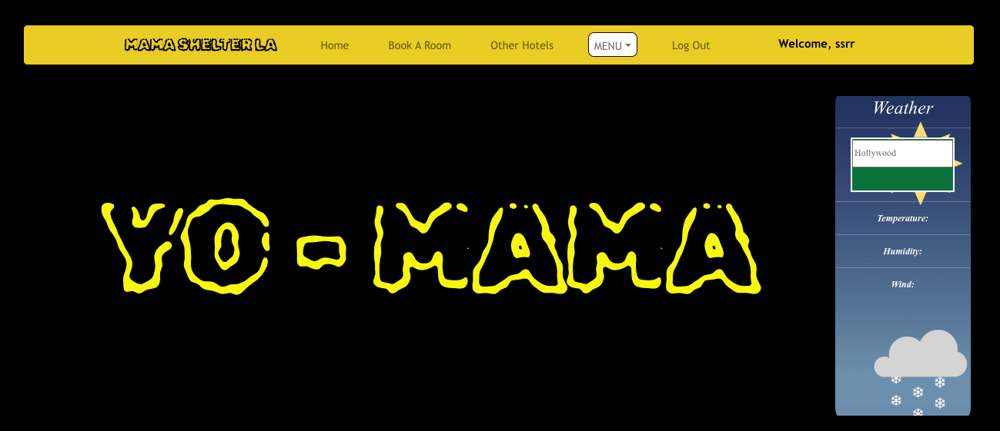
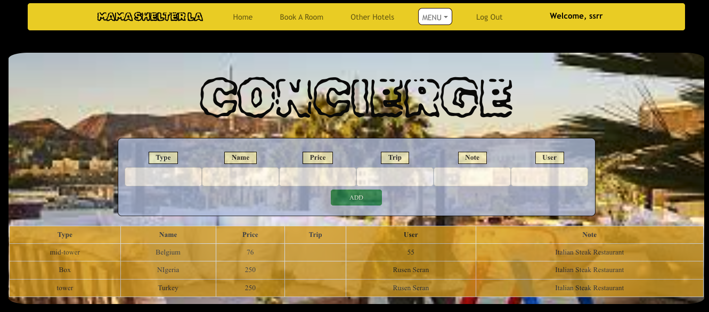
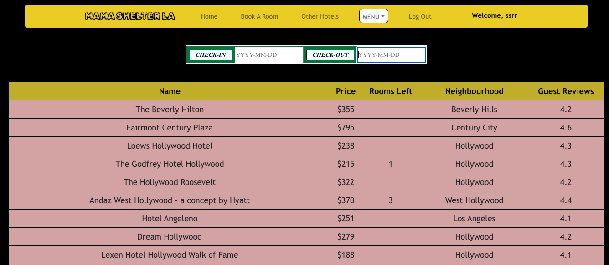
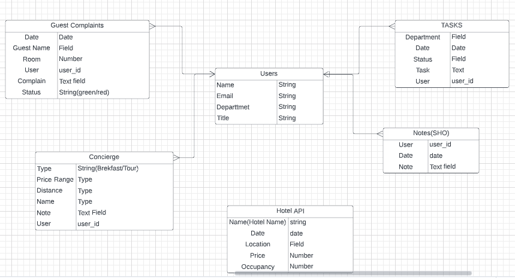
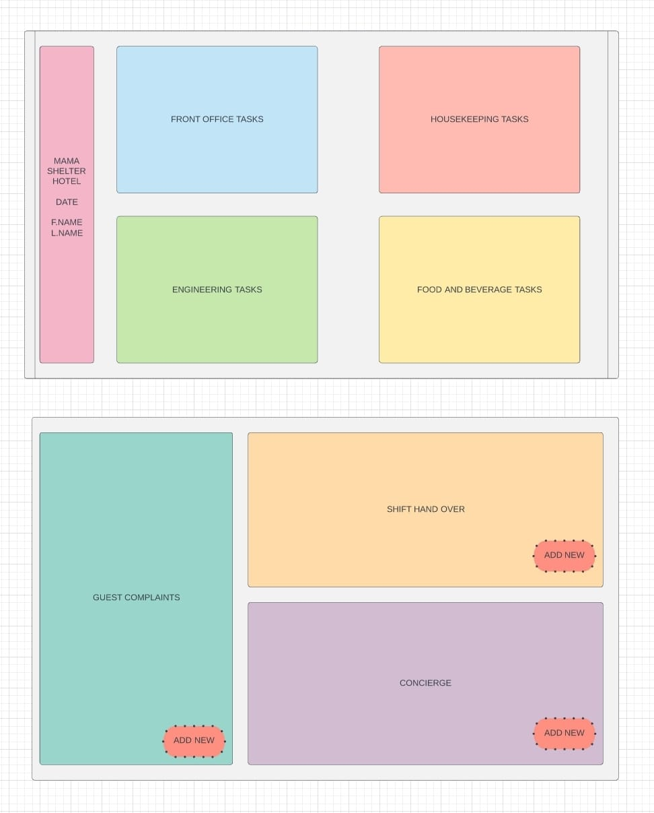

# Departments Communication App - Connecting People

### Purpose: Make communication easier between hotel departments

### Getting Started:
- Click on the link below
- Sign up by clicking on the 'Sign Up' tab
- Fill in the required field to create an account 

### LINK: (https://hotelcommunicationapp.herokuapp.com/)

### Screenshots:

### [ERD] (https://lucid.app/lucidchart/a8def6a0-c439-4cbf-a77d-9e4bb6ca6025/edit?invitationId=inv_4f889782-cda2-4b97-9ac3-50b9fe70b5be&page=0_0#)

### [TRELLO BOARD] ()

### [WIREFRAME] (https://lucid.app/lucidchart/a8def6a0-c439-4cbf-a77d-9e4bb6ca6025/edit?invitationId=inv_4f889782-cda2-4b97-9ac3-50b9fe70b5be&page=0_0#)

## USED TECHNOLOGIES:
*React
*Node.js
*HTML
*CSS 
*Bootstrap 
*Heroku 
*MongoDB
*JavaScript
*Express.js

## ICEBOX: 
- Allow user to upload profile picture
- Allow users to update created items
- Send notifications to related departments
- Allow users to create chat box

